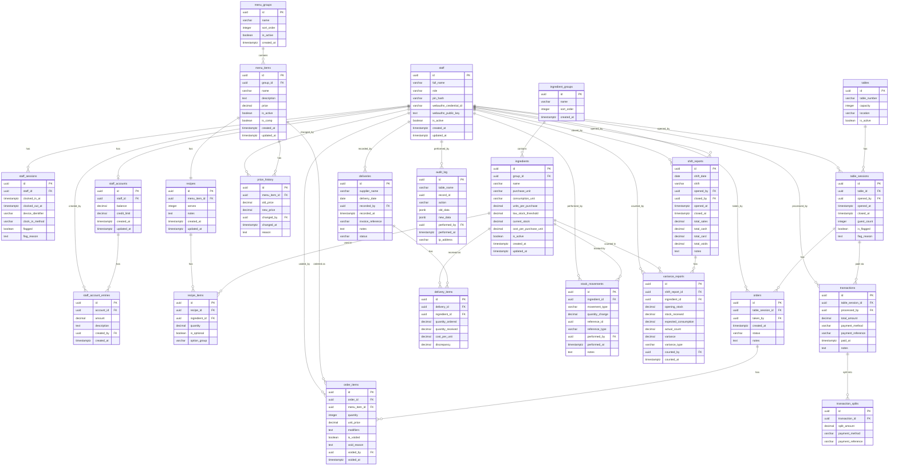

# Astar POS — Entity Relationship Diagram

> Generated: 2025-07-09 | All 23 tables | Database: PostgreSQL 16+

```mermaid
erDiagram

  %% ─── STAFF & AUTH ───────────────────────────────────────────────────────────

  staff {
    uuid    id                     PK
    varchar full_name
    varchar role
    varchar pin_hash
    varchar webauthn_credential_id
    text    webauthn_public_key
    boolean is_active
    timestamptz created_at
    timestamptz updated_at
  }

  staff_sessions {
    uuid    id               PK
    uuid    staff_id         FK
    timestamptz clocked_in_at
    timestamptz clocked_out_at
    varchar device_identifier
    varchar clock_in_method
    boolean flagged
    text    flag_reason
  }

  staff_accounts {
    uuid    id           PK
    uuid    staff_id     FK
    decimal balance
    decimal credit_limit
    timestamptz created_at
    timestamptz updated_at
  }

  staff_account_entries {
    uuid    id          PK
    uuid    account_id  FK
    decimal amount
    text    description
    uuid    created_by  FK
    timestamptz created_at
  }

  %% ─── INGREDIENTS & RECIPES ──────────────────────────────────────────────────

  ingredient_groups {
    uuid    id         PK
    varchar name
    integer sort_order
    timestamptz created_at
  }

  ingredients {
    uuid    id                     PK
    uuid    group_id               FK
    varchar name
    varchar purchase_unit
    varchar consumption_unit
    decimal units_per_purchase
    decimal low_stock_threshold
    decimal current_stock
    decimal cost_per_purchase_unit
    boolean is_active
    timestamptz created_at
    timestamptz updated_at
  }

  recipes {
    uuid    id           PK
    uuid    menu_item_id FK
    integer serves
    text    notes
    timestamptz created_at
    timestamptz updated_at
  }

  recipe_items {
    uuid    id            PK
    uuid    recipe_id     FK
    uuid    ingredient_id FK
    decimal quantity
    boolean is_optional
    varchar option_group
  }

  %% ─── MENU ───────────────────────────────────────────────────────────────────

  menu_groups {
    uuid    id         PK
    varchar name
    integer sort_order
    boolean is_active
    timestamptz created_at
  }

  menu_items {
    uuid    id          PK
    uuid    group_id    FK
    varchar name
    text    description
    decimal price
    boolean is_active
    boolean is_comp
    timestamptz created_at
    timestamptz updated_at
  }

  price_history {
    uuid    id           PK
    uuid    menu_item_id FK
    decimal old_price
    decimal new_price
    uuid    changed_by   FK
    timestamptz changed_at
    text    reason
  }

  %% ─── TABLES & ORDERS ────────────────────────────────────────────────────────

  tables {
    uuid    id           PK
    varchar table_number
    integer capacity
    varchar location
    boolean is_active
  }

  table_sessions {
    uuid    id               PK
    uuid    table_id         FK
    uuid    opened_by        FK
    timestamptz opened_at
    timestamptz closed_at
    integer guest_count
    boolean is_flagged
    text    flag_reason
  }

  orders {
    uuid    id               PK
    uuid    table_session_id FK
    uuid    taken_by         FK
    timestamptz created_at
    varchar status
    text    notes
  }

  order_items {
    uuid    id           PK
    uuid    order_id     FK
    uuid    menu_item_id FK
    integer quantity
    decimal unit_price
    text    modifiers
    boolean is_voided
    text    void_reason
    uuid    voided_by    FK
    timestamptz voided_at
  }

  %% ─── PAYMENTS ───────────────────────────────────────────────────────────────

  transactions {
    uuid    id               PK
    uuid    table_session_id FK
    uuid    processed_by     FK
    decimal total_amount
    varchar payment_method
    varchar payment_reference
    timestamptz paid_at
    text    notes
  }

  transaction_splits {
    uuid    id                PK
    uuid    transaction_id    FK
    decimal split_amount
    varchar payment_method
    varchar payment_reference
  }

  %% ─── DELIVERIES & STOCK ─────────────────────────────────────────────────────

  deliveries {
    uuid    id                PK
    varchar supplier_name
    date    delivery_date
    uuid    recorded_by       FK
    timestamptz recorded_at
    varchar invoice_reference
    text    notes
    varchar status
  }

  delivery_items {
    uuid    id                PK
    uuid    delivery_id       FK
    uuid    ingredient_id     FK
    decimal quantity_ordered
    decimal quantity_received
    decimal cost_per_unit
    decimal discrepancy
  }

  stock_movements {
    uuid    id              PK
    uuid    ingredient_id   FK
    varchar movement_type
    decimal quantity_change
    uuid    reference_id
    varchar reference_type
    uuid    performed_by    FK
    timestamptz performed_at
    text    notes
  }

  %% ─── REPORTING ──────────────────────────────────────────────────────────────

  shift_reports {
    uuid    id          PK
    date    shift_date
    varchar shift
    uuid    opened_by   FK
    uuid    closed_by   FK
    timestamptz opened_at
    timestamptz closed_at
    decimal total_sales
    decimal total_cash
    decimal total_card
    decimal total_voids
    text    notes
  }

  variance_reports {
    uuid    id                   PK
    uuid    shift_report_id      FK
    uuid    ingredient_id        FK
    decimal opening_stock
    decimal stock_received
    decimal expected_consumption
    decimal actual_count
    decimal variance
    varchar variance_type
    uuid    counted_by           FK
    timestamptz counted_at
  }

  %% ─── AUDIT ──────────────────────────────────────────────────────────────────

  audit_log {
    uuid    id           PK
    varchar table_name
    uuid    record_id
    varchar action
    jsonb   old_data
    jsonb   new_data
    uuid    performed_by FK
    timestamptz performed_at
    varchar ip_address
  }

  %% ─── RELATIONSHIPS ──────────────────────────────────────────────────────────

  staff                 ||--o{ staff_sessions          : "has"
  staff                 ||--o| staff_accounts           : "has"
  staff_accounts        ||--o{ staff_account_entries    : "has"
  staff                 ||--o{ staff_account_entries    : "created_by"

  ingredient_groups     ||--o{ ingredients              : "contains"
  ingredients           ||--o{ recipe_items             : "used in"
  recipes               ||--o{ recipe_items             : "has"
  menu_items            ||--|| recipes                  : "has"

  menu_groups           ||--o{ menu_items               : "contains"
  menu_items            ||--o{ price_history            : "has"
  staff                 ||--o{ price_history            : "changed_by"

  tables                ||--o{ table_sessions           : "has"
  staff                 ||--o{ table_sessions           : "opened_by"
  table_sessions        ||--o{ orders                   : "has"
  staff                 ||--o{ orders                   : "taken_by"
  orders                ||--o{ order_items              : "has"
  menu_items            ||--o{ order_items              : "ordered as"
  staff                 ||--o{ order_items              : "voided_by"

  table_sessions        ||--o{ transactions             : "paid via"
  staff                 ||--o{ transactions             : "processed_by"
  transactions          ||--o{ transaction_splits       : "split into"

  staff                 ||--o{ deliveries               : "recorded_by"
  deliveries            ||--o{ delivery_items           : "has"
  ingredients           ||--o{ delivery_items           : "received as"

  ingredients           ||--o{ stock_movements          : "tracked by"
  staff                 ||--o{ stock_movements          : "performed_by"

  staff                 ||--o{ shift_reports            : "opened_by"
  staff                 ||--o{ shift_reports            : "closed_by"
  shift_reports         ||--o{ variance_reports         : "has"
  ingredients           ||--o{ variance_reports         : "counted in"
  staff                 ||--o{ variance_reports         : "counted_by"

  staff                 ||--o{ audit_log                : "performed_by"
```
